# On JVMs - 1

---

Author: Neel Shah

Keywords: Java, Java Virtual Machines, compilation, interpretation, HotSpot VM

Pre-requisites: Simple programming

Programming: Programs along with a walkthrough for verification

---


## Introduction

Computer programs are essentially recipes that instruct the underlying hardware to execute a set of steps. The programmer expresses this recipe in a human-readable "high-level" programming language (C, Java, Python, Golang, etc.) which is (loosely) defined by a set of symbols and grammar (syntax). These instructions, encoded by the user in a high-level programming language, need to be translated or decoded into machine-readable "low-level" instructions.

There are broadly two ways of doing this translation from a high-level language to machine code: doing it all at once before running the code, and doing it instruction-by-instruction while running the code. The former is called "compilation" and the latter is called "interpretation". Since this is a characteristic of the high-level language, languages are classified as compiled and interpreted. Examples of compiled languages are C, C++, Golang, while Python, Javascript are interpreted languages.

Compilation and interpretation have their respective strengths and weaknesses, and the choice of execution strategy also has some interplay with other characteristics of a high-level programming language (type checking, garbage collection, and so on). 

Since this article is supposed to be about _Java_ Virtual Machines, and Java is missing from the list of examples, the first question we will ask is where Java lies in this classification of languages, and from there, we will explore what makes Java unique in this regard.


## Exposition

Most of us are likely to have encountered Java, either during a programming languages course, or as the backbone of technologies like Android, or as an example of an object-oriented language. You are sure to have seen this gem - 

<p align="center">
  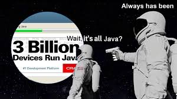
</p>

For any software or language to be so widely useful, it is essential that it be very versatile and highly portable. And the bulwark which supports these features is the Java Virtual Machine (JVM). In this piece, we shall explore how the JVM orchestrates Java code execution, and tinker with its working.


## Development

The promised answer to our aforementioned first question - whether Java is compiled or interpreted - _drumroll..._ - it is neither purely compiled, nor purely interpreted. This is how Java code is executed: say we have a file [helloworld.java](./java/helloworld.java) which contains some code we wish to execute. We open a command shell and do the following (you might have missed these if you use an IDE like Eclipse or IntelliJ - they do this in the background).

```sh
$ javac helloworld.java
$ ls
helloworld.class helloworld.java
$ java helloworld
Hello World!
```

When the `javac` command (_java compile_) runs, the Java code is converted into an intermediate form called _bytecode_. This bytecode is organized in the `.class` files. When we then run the `java` command, this bytecode is executed by the JVM. We shall see where and how.

When we talk about the Java _Virtual Machine_, we refer to a virtualization over an underlying hardware+OS system. This is what a VM looks like - 

<p align="center"> 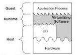 </p>

At the base, we have the hardware, which is interfaced with the Operating System (OS). We normally interact with the hardware through the OS. The VM is built over the OS. It (this particular type of VM, called process VM) also interfaces directly with the underlying hardware. When an application runs on the VM, it converts its instructions into a form that is native to the underlying system (hardware+OS). This allows us to run programs that might not be supported by the OS, or programs that need to circumvent the OS altogether.

The Java Virtual Machine is one such Virtual Machine. There are different JVMs for different hardware+OS combinations. What is common across JVM variants is the interface they provide to Java programs. It is a standard interface irrespective of underlying system. At the time of execution (also called runtime), the bytecode runs on the JVM. This means the bytecode can be run on any machine which has the JVM installed (with the correct Java version of course). This is one of the most popular features of the JVM. The Java bytecode is highly portable. This is highly advantageous when the same code needs to be run across machines having different systems. Rather than compiling code separately on each machine, and having to worry about whether the system will support it, the JVM allows the programmer to compile and test the code on a single machine or a small cluster, and then distribute the bytecode across a larger cluster of machines. Issues such as testing, build latency and deployment latency are critical in a production environment, and the JVM simplifies things to a great extent. 


## Verse 1 - Of compilation and interpretation

We left our java program at the bytecode stage. The bytecode is now some kind of (portable) intermediate representation of the original Java code, but it is yet not machine code. The JVM now has a decision to be made - it can either compile the bytecode into native machine code before execution, or it can interpret the bytecode line-by-line at runtime. And here's where the JVM plays its magic: it does both. Rather, it makes on-the-fly decisions about what to do.

Code is interpreted line-by-line, so there is very little meta-awareness about the code that is running. The interpreter avoids making strong decisions about the code, since several decisions are made strictly at runtime (types in Python, for example). One outcome of this is that the interpreter might end up running a lot of redundant code. Standard libraries might be interpreted redundantly, for instance. And this could have been avoided by a compiler, since it would be aware of the code being compiled, and store references to the existing copy of the compiled code. If the interpreter could do something similar, it could avoid redundant work. 

The JVM, therefore, starts off by running the bytecode on an interpreter, and when a certain threshold is breached, it _starts compiling code before it is executed_. Mind you, all of this happens at runtime. So the code is compiled just before it is executed. Hence this is known as _just-in-time (JIT)_ compilation. The other option would be to compile all the code before runtime, and is known as _ahead-of-time (AOT)_ compilation.

Let us now take a look at how the interplay of the compilation and interpretation configurations affects execution time.


## Refrain - The Code

Going forward, after every statement we make, we shall verify it by running some code and examining the output. Note that we shall be using JDK-8. A number of very interesting features such as AOT compilation were added to JDK-9 and later versions, but at the moment, JDK-8 continues to remain the most widely used. We shall attempt to take up the new JVM versions in a later article.

The program we shall use takes a string and counts the number of uppercase letters it contains. It does this a million times per cycle and repeats the cycle a certain number of times. At the end of each cycle it prints the time taken for execution. The code can be found [here](https://gist.github.com/neelkshah/08b44407fd810cce6b5b10fd939a9d9e#file-countuppercase-java) ([credits](https://www.graalvm.org/docs/examples/java-performance-examples/)).

The file is called CountUppercase.java, and we shall compile and run it (plain and vanilla) using the following commands:

```
$ javac CountUppercase.java
$ java CountUppercase Golang is The Best
```

And voila! The output looks like 

<p align="center"> 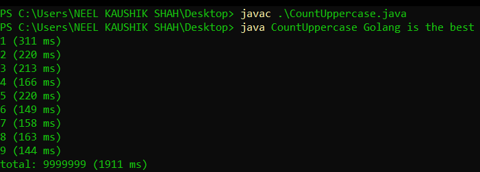 </p>

Observe that the execution time decreases with cycle. It goes from 311ms to 144ms. You can try this for yourself and also tinker around with the number of iterations and the input.


## Verse 2 - Hot Stuff

Run the following command in a shell

`$ java -version`

The output looks like

<p align="center"> 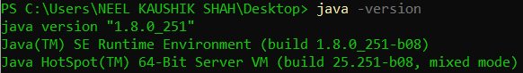 </p>

This tells us that the Java version we are using is 1.8, also read as 8, and the VM in use is the HotSpot VM (note that the build versions are the same for all components; as long as that's fine, we're nice and portable). Let's break down this last line - _Hotspot 64-bit Server VM (mixed mode)_.

Since Java is intended to support enterprise-grade systems, the compiler will be called on to work its magic on both, long-running server code, as well as short duration client processes. So the HotSpot VM operates in two modes - a server mode and a client mode. For 64-bit machines, it assumes processes will be server-like, and by default operates in the server mode. We can specify the mode at the time of firing the `java` command using the `-client` and `-server` flags. Let's see what the output looks like in either case.

<p align="center"> 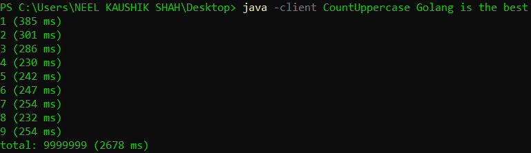 </p>

<p align="center">  </p>

We can see that in this case, the server mode very marginally outperforms the client mode. While our program doesn't clearly classify as server-like or client-like, we can see that there is a choice of execution mode and it makes a difference to the execution. I encourage you to try out each of these flags the next time you run your Java programs and observe the difference in outcome.

The second part of the HotSpot VM output is _mixed mode_. And this is the bit where the HotSpot VM derives its name from. As we stated earlier, Java bytecode is part-compiled and part-interpreted. The way the HotSpot VM starts by interpreting the bytecode. While the code is executing, it records metadata about _hotspots_ in the execution - code that runs repeatedly, redundancies, branching behaviour, bottlenecks and so on. After a threshold number of method invocations have been made, the HotSpot VM switches over to the JIT compiler - that is, it starts compiling the bytecode on-the-fly, right before it is executed. And while doing this, it makes use of the metadata it has recorded earlier to make on-the-fly optimizations. Note that these optimizations would be missed if the code was compiled ahead-of-time, since in that case the compiler would be running cold and would have no information about the runtime.

We can configure the method invocation threshold after which compilation kicks in by using the `-XX:CompileThreshold=<value>` flag. The default value for the server mode is 10000, and for the client mode is 1500. You could try tinkering with these values (note that the number of method invocations depends on your code).

<p align="center"> 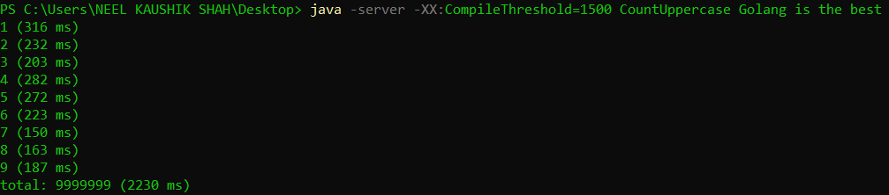 </p>

## Verse 3 - Through the Looking Glass

This was the balance that HotSpot strikes between compilation and interpretation. Let's now try executing the mode in purely interpreted and purely JIT-compiled fashion and compare their respective outcomes, also with the vanilla execution. For this we shall use the `-Xint` and `-Xcomp` flags along with the `java` command.

<p align="center"> 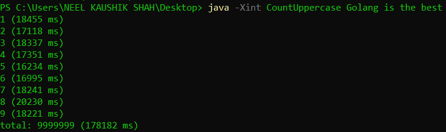 </p>

<p align="center">  </p>

<p align="center">  </p>

We can see the stark differences in the three runs. Purely interpreted execution takes several times the execution time as compared to the vanilla model and the JIT compilation. Even the JIT compiled execution takes more time than the vanilla execution. This tells us that pure interpretation is clearly doing a whole lot of unnecessary work, and pure compilation is missing out on the benefits of hotspot elimination.

Let us take a look at what the compiler takes care of, that the interpreter does not. We can print JIT compiler logs by setting the `-XX:+PrintCompilation` flag. The output is pretty long, so I shall insert the beginning and the end, since those are the portions of interest.

<p align="center"> 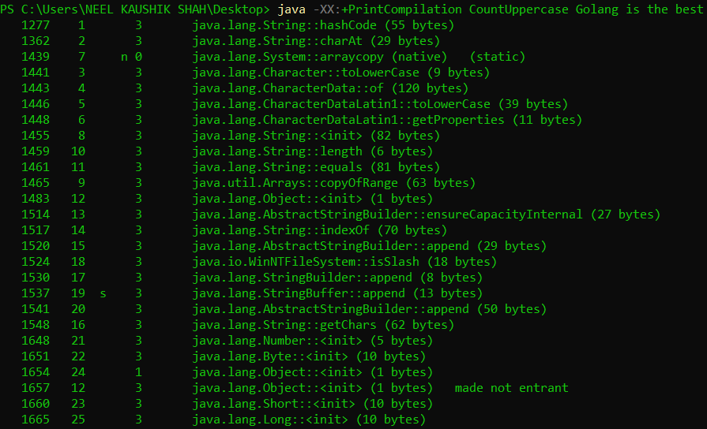 </p>

<p align="center"> 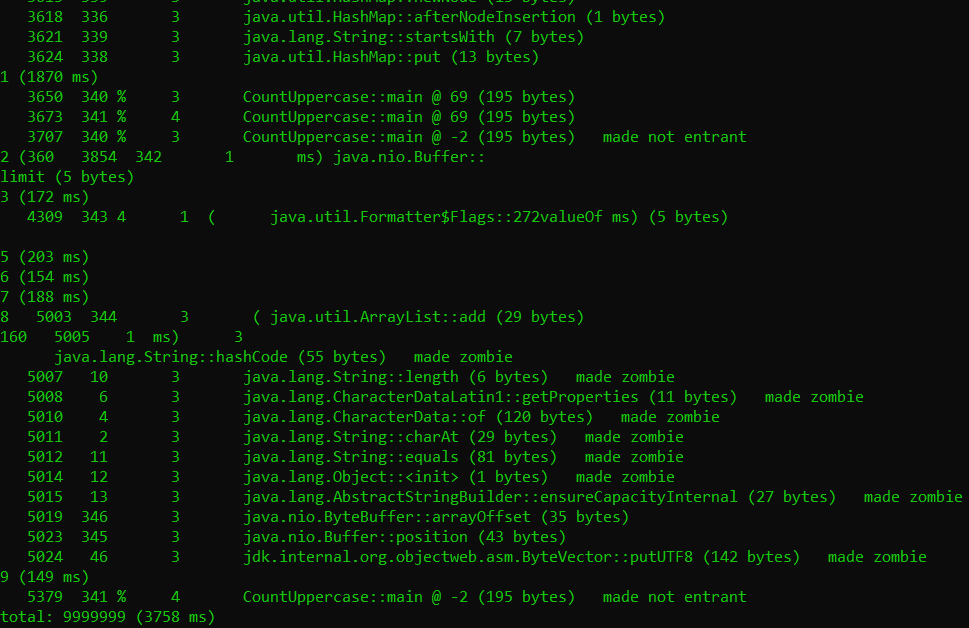 </p>

We can see that a number of standard and internal methods are compiled at the very start. The output from our code is interleaven with the compiler logs, and is generalyl bunched together towards the end. This tells us that the compiler is not processing the same code redundantly. We also see a lot of metadata being generated: the third column in the output (consisting of single digit integers) is the tier at which that code was compiled. The JIT compiler has a tiered structure, the details of which we shall not go into right now. But again, this is configurable using the `-XX:+TieredCompilation` (default) and `-XX:-TieredCompilation` flags. This is what non-tiered compilation output looks like

<p align="center"> 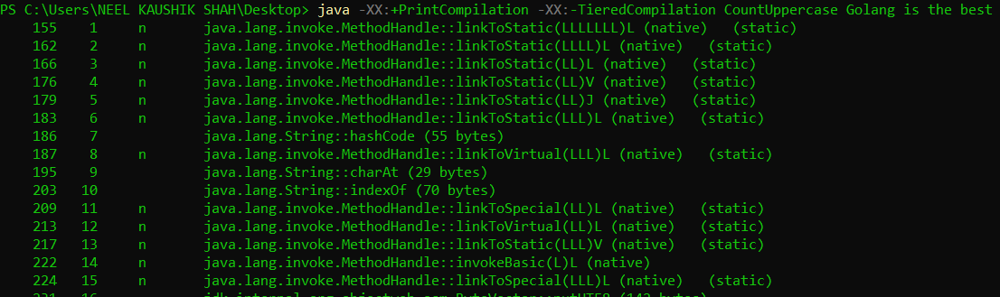 </p>
 
<p align="center"> 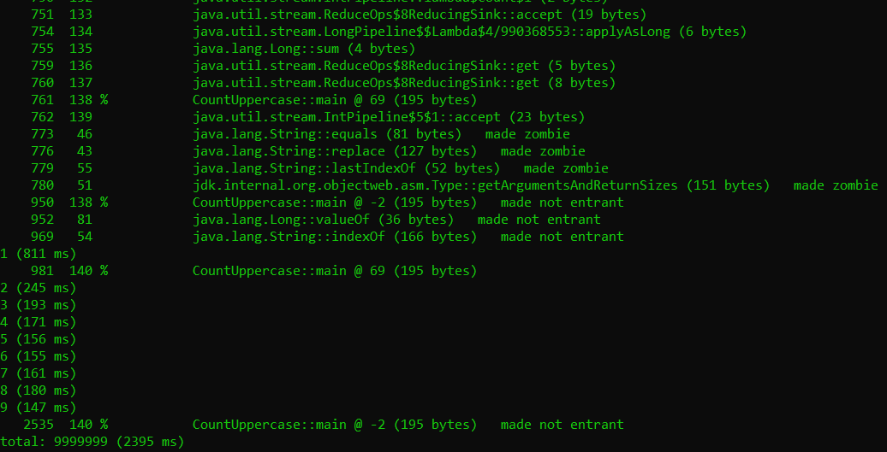 </p>

Something even more interesting to notice is the `made not entrant` and `made zombie` labels. This is basically the compiler saying it has decided to roll back some optimizations it made earlier. For example, the compiler tries to reason about a few future steps of all possible outcomes of a branching point in execution. After a while, based on some dynamic decision, it might decide to abandon a portion of this execution (by making it zombie). So an added advantage of JIT compilation is the deoptimization that it can do on the fly.


## Coda

The JVM is a beautifully architected and engineered workhorse that powers the numerous and versatile applications that run on Java. In this article, we have attempted to understand parts of its structure by tinkering with some configurable parameters. 
