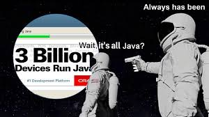
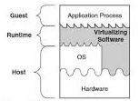

# On JVMs - 1

---

Author: Neel Shah

Keywords: Java, Java Virtual Machines, compilation, interpretation, HotSpot VM

Pre-requisites: Simple programming

Programming: Programs along with a walkthrough for verification

---


## Introduction

Computer programs are essentially recipes that instruct the underlying hardware to execute a set of steps. The programmer expresses this recipe in a human-readable "high-level" programming language (C, Java, Python, Golang, etc.) which is (loosely) defined by a set of symbols and grammar (syntax). These instructions, encoded by the user in a high-level programming language, need to be translated or decoded into machine-readable "low-level" instructions.

There are broadly two ways of doing this translation from a high-level language to machine code: doing it all at once before running the code, and doing it instruction-by-instruction while running the code. The former is called "compilation" and the latter is called "interpretation". Since this is a characteristic of the high-level language, languages are classified as compiled and interpreted. Examples of compiled languages are C, C++, Golang, while Python, Javascript are interpreted languages.

Compilation and interpretation have their respective strengths and weaknesses, and the choice of execution strategy also has some interplay with other characteristics of a high-level programming language (type checking, garbage collection, and so on). 

Since this article is supposed to be about _Java_ Virtual Machines, and Java is missing from the list of examples, the first question we will ask is where Java lies in this classification of languages, and from there, we will explore what makes Java unique in this regard.


## Exposition

Most of us are likely to have encountered Java, either during a programming languages course, or as the backbone of technologies like Android, or as an example of an object-oriented language. You are sure to have seen this gem - 



For any software or language to be so widely useful, it is essential that it be very versatile and highly portable. And the bulwark which supports these features is the Java Virtual Machine (JVM). In this piece, we shall explore how the JVM orchestrates Java code execution, and tinker with its working.


## Development

The promised answer to our aforementioned first question - whether Java is compiled or interpreted - _drumroll..._ - it is neither purely compiled, nor purely interpreted. This is how Java code is executed: say we have a file [helloworld.java](./java/helloworld.java) which contains some code we wish to execute. We open a command shell and do the following (you might have missed these if you use an IDE like Eclipse or IntelliJ - they do this in the background).

```sh
$ javac helloworld.java
$ ls
helloworld.class helloworld.java
$ java helloworld
Hello World!
```

When the `javac` command (_java compile_) runs, the Java code is converted into an intermediate form called _bytecode_. This bytecode is organized in the `.class` files. When we then run the `java` command, this bytecode is executed by the JVM.

When we talk about the Java _Virtual Machine_, we refer to a virtualization over an underlying hardware+OS system. This is what a VM looks like - 



At the base, we have the hardware, which is interfaced with the Operating System (OS). We normally interact with the hardware through the OS. The VM is built over the OS. It (this particular type of VM, called process VM) also interfaces directly with the underlying hardware. When an application runs on the VM, it converts its instructions into a form that is native to the underlying system (hardware+OS). This allows us to run programs that might not be supported by the OS, or programs that need to circumvent the OS altogether.

The Java Virtual Machine is one such Virtual Machine. There are different JVMs for different hardware+OS combinations. What is common across JVM variants is the interface they provide to Java programs. It is a standard interface irrespective of underlying system. At the time of execution (also called runtime), the bytecode runs on the JVM. This means the bytecode can be run on any machine which has the JVM installed (with the correct Java version of course). This is one of the most popular features of the JVM. The Java bytecode is highly portable. This is highly advantageous when the same code needs to be run across machines having different systems. Rather than compiling code separately on each machine, and having to worry about whether the system will support it, the JVM allows the programmer to compile and test the code on a single machine or a small cluster, and then distribute the bytecode across a larger cluster of machines. Issues such as testing, build latency and deployment latency are critical in a production environment, and the JVM simplifies things to a great extent. 


## 
